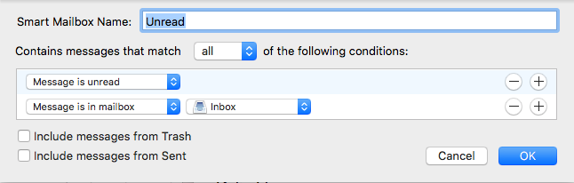

People kept calling Einstein a genius. He got frustrated and said "Genius is focus". He meant that genius to him was just being able to stay focused. For our purposes, staying focused means not getting distracted. So let's look at some strategies to stay focused and avoid distractions.

# Manage your Notifications

Desktop Notifications are annoying and steal your time and productivity—what will make you a successful developer. Let's turn them off.

> [action]
>
> 1. Head back over to system preferences, and click on "Notifications".
> 1. Select Mail, Messages, Discord, Slack, Calendar, and any other app that might throw a lot of notifications and customize their alert styles to your preference.

You will still check these apps, but you will check them on your time, not because they shoot a notification at you when you are trying to focus on something else.

# WakaTime

You are here to code, and what better service could you use than a "FitBit for Coding". So we've bought you a free license for some excellent software that will give you insights into how and when and how much you code.!

[WakaTime](https://www.wakatime.com) was invented by one of Captain Rainbow's friends Alan Hamlett. It gives you and your coach the ability to see exactly how much you are coding, in which languages, and on what projects.

> [action]
>
> 1. Go to [wakatime.com](https://www.wakatime.com) and register using your @students.makeschool.com email. **DO NOT SIGNUP WITH GITHUB**
> 1. Go to WakaTime's [Supported Editors](https://wakatime.com/editors) page and select any and all IDE's you use. We recommend [VS Code](https://wakatime.com/vs-code) and [Xcode](https://wakatime.com/xcode) (if you are a mobile student). Follow those instructions.
> 1. TEST! - Open your editor, start typing some stuff, then look in your wakatime dashboard and verify the connection has been made.

# Rescue Time & Self Control

Here are some tools to not get distracted:

[Rescue Time](https://www.rescuetime.com/)

[Self Control](https://selfcontrolapp.com/)

> [action]
>
> 1. Download them and install them.
> 1. Put a reminder on your calendar to try them out.

# Email Client

You have at least 2 email addresses now, so let's use the Mail app on your computer to manage them both quickly.

> [action]
>
> 1. Hit `command`+`spacebar` and type "mail" and hit enter.
> 1. Hit `command`+`,` to get to settings and do the following steps:
> 1. Click "Accounts" and click "+"
> 1. Add your personal email address
> 1. Click "+" again and add your student email address
> 1. Close the settings window

Now you should have both of your email accounts present in your Mail client.

# Smart Mailboxes: Unread

Let's use SmartMailboxes to find and manage unread emails:

> [action]
>
> 1. Look for the line on the left side that says **Smart Mailboxes**.
> 1. Click the "+" and create an **Unread** Smart Mailbox. This will pull all your unread emails into this smart mailbox
>
    
>
> 1. Drag the **Smart Mailboxes** up to the top of the left gutter for easy access.

# Clean Up Old Unreads

Sometimes you get a few hundred or thousand unread emails in the hole and it is impossible to mark them all as read. Take this time to start fresh and mark all your old emails as read.

> [action]
>
> [Mark Entire Gmail Inbox as Read](https://smallbusiness.chron.com/mark-entire-gmail-inbox-read-72002.html)

# Slack Desktop & Mobile

It is critical that you have slack setup. This will be the primary way you interact with instructors and other faculty at Make School.

> [action]
>
> 1. Please download the Slack app on your phone and the [Desktop](https://slack.com/downloads/osx) client.
> 1. Sign into the Make School Students workspace: `makeschoolstudents.slack.com`

# Setting Up Music

Music can help you focus, but it can also be a distraction if you are always fiddling with it.

> [action]
>
> Take a minute to reflect on if you like to listen to music when you code, and if music is helping or hurting your level of focus.

### Music Tips

1. Listen to music without lyrics
1. Setup radio stations or playlists that you like ahead of time so you can just hit play and not be interrupted for 2-3 hours.
1. Use earbuds or over-ear headphones that block out other sound and show people that you are busy working and not to distract you.
