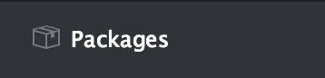
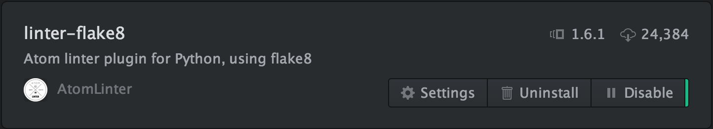
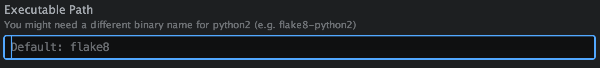

#Python Environment

Make sure you install the iOS environment first - the instructions assume you have, because you will need Command Line Tools and Homebrew installed already.

##Python 3

OS X comes with a version of Python (2.7) installed by default. We can call that the *system Python*. But that version is old! Python 3 was released in 2008, and it came with a bunch of syntax changes that were incompatible with 2.x versions of Python. This created a fork in the language, as many large Python projects (including many helpful libraries) didn't want to invest the time to convert to 3.x.  But that was then; it's now recommended that all new Python projects are made in Python 3.x. For more information, see [this article](https://wiki.python.org/moin/Python2orPython3). 

So we're going to install the newest Python.

*These instructions are derived from [this great post](http://www.marinamele.com/2014/07/install-python3-on-mac-os-x-and-use-virtualenv-and-virtualenvwrapper.html)*.

Use Homebrew to install Python 3 and its dependencies:

	$ brew install python3
	
Once that's finished, you should be able to see which version of Python installed like this:

	$ python3 --version

That will also install the Python package manager, called `pip`, which can be used to download Python libraries. Because we're using Python 3, you should always use `pip3`, which is the Python 3 version.

##Virtualenv

By default, `pip` and `pip3` install packages into a directory used by Python system-wide. This can create problems, because different Python projects might be dependent on different versions of libraries. Upgrading a library on one project might break all of your other projects, which is a nightmare.

`virtualenv` is the solution to this problem. Here's the [official documentation](https://virtualenv.pypa.io/en/latest/), but the TL;DR is that for each project it creates a virtual environment in which packages are installed, and ensures that the project is not dependent on any packages outside the virtual environment. 

To install `virtualenv`, use the following command

	$ pip3 install virtualenv
	
As you create each Python project, you will also want to create an associated virtual environment in which you can install packages.

##Atom

Download and install Atom. Atom is a an open-source text editor maintained by Github, that we will use to write our Python source.

[https://atom.io/](https://atom.io/)

##Atom Python Packages

*These instructions are derived from [this blog post](http://www.marinamele.com/install-and-configure-atom-editor-for-python)*. 

We're going to install some packages for Atom that makes writing Python much faster by providing real-time validation of your code. In general, these programs are called *linters*.

First we'll use the Atom Package Manager to install `linter`. Linter provides a single api that all the language-specific linters can use to interact with Atom.

	$ apm install linter

Next we'll install the Python linting package, which is called `flake8`. There are two components - one which is a Python package, which takes the actual Python text and checks it with the compiler. We'll install that now.

	$ pip3 install flake8
	$ pip3 install flake8-docstrings
	
The other component is the Atom package that acts as the glue between `flake8` and `linter` to provide Atom with the real time validation.

	$ apm install linter-flake8
	
Finally, we have to make some changes to Atom. First we'll change the init script that runs every time Atom is opened.

In the menu, go to Atom --> Open Your Init Script.

Add the following line at the bottom:

	process.env.PATH = ['/usr/local/bin/', process.env.PATH].join(':')
	
Save that file.

Next we need to change a setting in the `linter-flake8` package. Go to the Atom Preferences page from the Atom menu. Click the packages menu item.

Find the `linter-flake8` package and click the settings button.

*NOTE: If you don't see a settings button, try restarting Atom. Also ensure that you installed Atom into your Applications directory and that you're running that Atom.*

Find the executable path setting:

To figure out where the `flake8` executable is located in our filesystem, we can use the `which` command. Go to the terminal and type:

	$ which flake8
	
Take the result of that command, and paste it into the exectuable path setting in Atom.

> [info]
> 
In my case, `flake8` was here:
>
	/Library/Frameworks/Python.framework/Versions/3.5/bin/flake8
	
Now there's a few more Atom settings to check.
	
##Atom Settings

There's long been a religious war between proponents of tabs and spaces in source code. It's a particularly important topic in Python programming, because white space is actually part of the syntax. The Python Style Guide, known as [PEP8](https://www.python.org/dev/peps/pep-0008/) says that Python code should use only spaces, cannot mix spaces and tabs, and that code blocks should be indented by 4 spaces each.

To make sure we don't mess this up, let's have Atom help us out by emitting 4 spaces when pressing the tab key.

Go to Atom Preferences, the Settings Tab and find the Soft Tabs option. Make sure it's checked.

Then scroll down and make sure tabs emit 4 spaces:

##Testing it Out

Now we can test our environment. Restart Atom. Then create a new file and save it as *test.py*. Or anything.py really, but make sure it has the .py extension, so that Atom knows that it's Python source. 

Try testing some gibberish in the editor - you should see the linter issues appear at the bottom:

