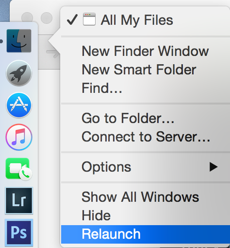

A developer lives in their terminal. So we're going to make our terminal pretty and work well.

# Making Your Terminal Professional

> [action]
>
> 1. Use the keyboard shortcut `command` + `spacebar` and type "terminal" to open your terminal.
> 1. Now use the keyboard shortcut `command` + `,` to open your preferences (this keyboards shortcut works for every program on your computer!).
> 1. Set your profile to "Pro" and click "Default".

Looking professional! Don't worry about the profile for now, we're going to change it in the next section.

# Adding Oh-My-Zsh

Next we're going to enhance our terminal with [Oh-My-Zsh](https://github.com/robbyrussell/oh-my-zsh), a zsh shell configuration. (It will make your terminal pretty and work better).

> [action]
>
> 1. Install oh-my-zsh by following the instructions in the [Basic Installation](https://github.com/robbyrussell/oh-my-zsh#via-curl) section. Be sure to use the `curl` install method
>
> 1. Now close and restart your terminal and you should see a colorful little terminal prompt now.  
>
	```bash
	$ ~
	```
>

Nice!

# Making a dev or code directory

All good developers have well organized folders and files in their computer. Always keep your folders, files, and desktop clean and organized. It will make you work faster and look and feel more professional.

> [info]
> Whenever you see code prefixed with a dollar sign $, that indicates that it's a command to be entered in the command prompt. Don't include the $ when you paste the command in.

A best practice to organize your code projects is to create one folder called either `dev` or `code` in the root of your computer.

> [action]
>
> 1. Use your terminal to make this now.
>
	```bash
	$ ~ mkdir dev
	$ dev
	$ dev mkdir courses
	```
>
> 1. Now you are in your `dev` folder. You should move your portfolio coding projects into this folder and also where you should instantiate all new portfolio coding projects.
> 1. Let's add one more thing which is a folder for your courses. In this folder you can make directories for your coursework.
>
	```bash
	$ dev
	$ dev mkdir courses
	```

# Show Hidden Files

As a developer, it's often very useful to be able to see hidden files and folders in Finder. They're hidden because messing with them can cause problems, but we're fancy-pants developers and we're not afraid.

It's useful, because command line tools are installed in hidden folders, Git repositories live in hidden `.git` directories, your bash path file is a hidden file, etc.

> [action]
>
> 1. To do this, type this command into your command prompt:
>
	```bash
	$ defaults write com.apple.finder AppleShowAllFiles YES
	```
>
> 1. Then restart Finder by right clicking the Finder icon while holding the *option/alt* key and choosing relaunch.
>
	
>

<!-- -->

> [info]
> It's easy to reverse this change - just follow the same steps, replacing `YES` with `NO`.

# Homebrew

Homebrew is a package manager for Mac OS. It makes it easy to install software packages from the terminal while also installing and managing their dependencies. For more information, see the [Homebrew website](http://brew.sh/)

> [action]
>
> Install Homebrew by following the install instructions on the [Homebrew website](http://brew.sh/)

If you already have Homebrew installed, you need to update your formulae by running:

```bash
$ brew update
```

This may take several minutes to download updates, so be patient while it completes.

# Setting Up Git and Github

Git and Github are super important and awesome tools for tracking, revising, and collaborating on code projects. Let's get your computer setup to use Git and Github.

## Why Use Git?
In short, developers use git to collaborate on a project simultaneously and save snapshots of different versions of the project.

Watch this 5 min video by Paul Programming where he explains the value of using git:


## Install / Setup

> [action]
>
> 1. Install git if you haven't already.
>
	```bash
	$ brew install git
	```
>
> 1. Head over to [github.com](github.com) and sign up for an account using your personal email address if you don't already have one.
> 1.  Configure your global username and email address.
>
> **‼️ IMPORTANT: If you skip this step, Git will produce a warning each time you push to a remote branch.**
>
```bash
$ git config --global user.name "YOUR_NAME"
$ git config --global user.email "YOUR_PERSONAL_EMAIL@example.com"
```
>
> Finally, double-check your settings:
>
```bash
$ git config --list
>
credential.helper=osxkeychain
user.name=Dani Roxberry
user.email=dani@bitoriented.com
url.ssh://git@github.com/.insteadof=https://github.com/
mergetool.keepbackup=false
core.excludesfile=/Users/dani/.gitignore_global
core.editor=code
filter.lfs.required=true
filter.lfs.clean=git-lfs clean -- %f
filter.lfs.smudge=git-lfs smudge -- %f
filter.lfs.process=git-lfs filter-process
```

# Generating and Configuring SSH Keys

SSH keys are a cryptographic way to secure your connection between your computer and GitHub. Setting them up will make it so you don't have to login through your terminal when you are trying to push. Let's set them up:

> [action]
>
> Run the following commands.
>
> **‼️ IMPORTANT !!: DO NOT ENTER A PASSWORD WHEN PROMPTED**. Just hit enter.
>
```bash
$ ssh-keygen -t rsa -C "your.email@example.com" -b 4096
$ cat ~/.ssh/id_rsa.pub
>
ssh-rsa AAAAB3NzaC1yc2EAAAADAQABAAACAQC+SJSGSCeSeLnOg543Hyqh3OcAENvugks8ygkoOkEA4g652gK0ES7CjjpBy4GS/XnaUWiD9iaoE4soE8dqhe/psCoiU+QxGmkjNapLtQAOu1W2v/SEh3Jao+rtfop0S+Ak96fiOVgUgupFAN1FXV1iYdpwyk7rR3Kv/T2M9Ce06Bk5KupdgNzF7Eg/tmFx8H2yVmeQ2J3MWM948ZvWmbBwtbcDRQ6ZtnXSoEof1Wg8agzyisq0Yoi3rXqAIxr1Hevs4g79Lrf65548yTfqZqyljSFA/h4VntXsZYKIWoXti5uPstrwRF6oaH8dm1l74jLAKC/XlqnsqVkRWn/Updj+x8g3+EdtFiWpUwEIMWWDbjPk0HHTfOS06716Hcji0hg4Kfipe03QjhD8Vqp/snaYCb8R3OSZOK1H3Zj9n1JgHhOoFYzk0gstV9DGRmrm2ywrQh3Q7fs23pzrZARGBhRHwk5XfFQl85D7oJffBbfpqjDdyzcHYOAo3mlDfwkfl1nHxynWrwCk+0KKD0zLVsqtkSVlNfQv2JqSSc6ox6vktO7RWKg5/T0b9r0fnNcYfGBVnoJDulJPJr7ynSUDRi2hX5WpMDomylUahVYN/VlAZBwvuWdOM0h3ZUsQEPjauN0k+mY3nQVTIa0hWl1vszTddcxLZKK5mJsvlnL7HMBQxQ== dani@bitoriented.com
```
> With your mouse, highlight the entire [public key](https://en.wikipedia.org/wiki/Public-key_cryptography), beginning with `ssh-rsa` and ending with your email address. Copy the highlighted public key to the clipboard.

## Add the key to [GitHub](http://github.com)

> [action]
>
> 1. Click the above link, log in, and navigate to your account "Settings".
> 1. Click on SSH and GPG Keys section.
> 1. Paste your key in the 'Key' section and give it a relevant `Title`. Use an identifiable title like `Work Laptop` or `Home MacBook Pro 15`.
> 1. **Make sure you copied the entire key starting with `ssh-rsa` and ending with your email.**
> 1. Test your setup by running `ssh -T git@github.com`:
>
```bash
$ ssh -T git@github.com
>
Hi droxey! You have successfully authenticated, but GitHub does not provide shell access.
```

# Practice Git

Now that you have a general understanding of git, practice your skills at [Learn Git Branching](https://learngitbranching.js.org/). This is a great way to learn and practice the basics of git from the browser with a guided tutorial.

> [action]
>
> Complete at least the following sections from [Learn Git Branching](https://learngitbranching.js.org/):
>
>- On the `Main` tab, do the `Introduction Sequence`, parts 1-4
>- On the `Remote` tab, do Push and Pull Git Remotes, parts 1-7
>- Complete extra sections to level up your git skills even more

## Extra Resources

* [A Visual Git Reference](https://marklodato.github.io/visual-git-guide/index-en.html)
* [Learn Git in 30 Minutes Tutorial](https://tutorialzine.com/2016/06/learn-git-in-30-minutes)
* [Git-Tower.com - Learn Version Control with Git - Ebook](https://www.git-tower.com/learn/git/ebook/en/command-line/introduction)
* [Git-Tower.com - Learn Version Control with Git - Videos 1-8](https://www.git-tower.com/learn/git/videos#episodes)
