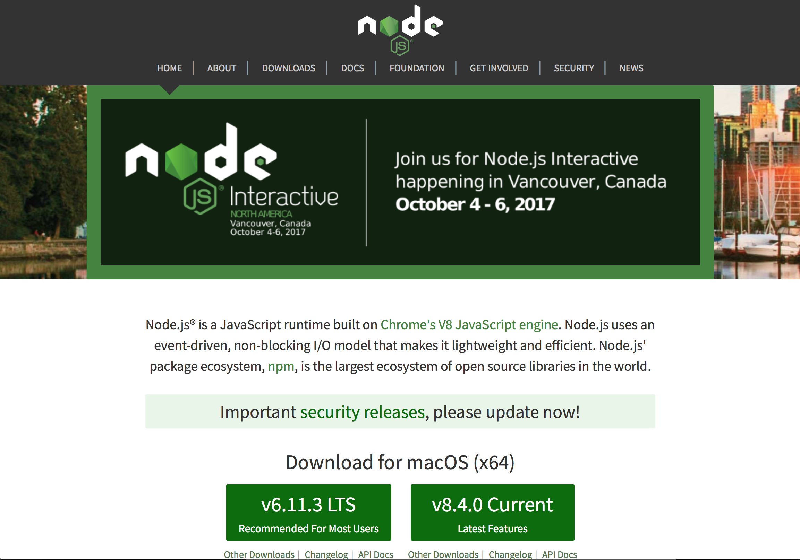

# Node

You will need node to run Express, packagers such as NPM and build systems like Webpack. 

## Node

Visit [Nodejs.org](https://nodejs.org/en/). 

Download the latest version for your system. There should be a big green button. 

This should download the installer. Run the installer. 

Follow the instructions. 

Your done!

### Check your Node installation

Open the Terminal. Check your Node version by entering the following: 

`node -v`

You should see something like: `v8.4.0` or `v6.1.4` or which ever version you installed. 