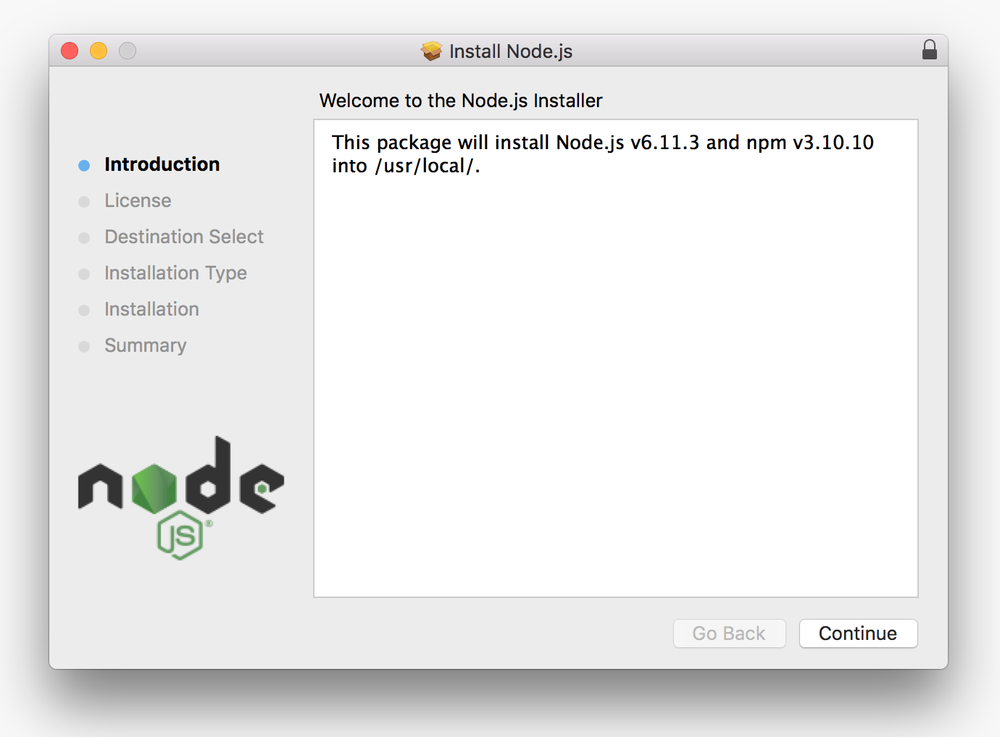

# Web Environment

These installation instructions are required for all students following the Full Stack Web track and/or taking WEB courses.

## Node.js

You will need Node.js to run packagers such as NPM, web servers like Express, and build systems like Webpack.

Visit [Nodejs.org](https://nodejs.org/en/). 

Download the latest LTS version for your system. There should be a big green button. 
Choose the button on the left, which should show LTS (Long Term Support). 

Download and run the installer.

Follow the instructions and you'll be done!

### Check your Node installation

Open the Terminal. Check your Node version by entering the following: 

    node -v

You should see something like: `v6.11.3` or which ever version you installed.
